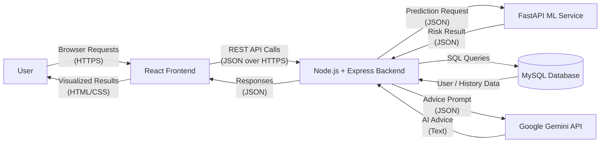

# System Diagrams, Data Dictionary, and Decision Tables

This document summarizes the HeartWise system architecture with level-wise data flow diagrams, a data dictionary, and key decision tables.

---

## Level 0 – Context Data Flow Diagram



---

## Level 1 – Prediction Flow (Client to Backend)

```mermaid
flowchart LR
    subgraph Client
      U[User]
      FE[React Input Form]
    end

    subgraph Backend["Node.js + Express<br/>Backend Service"]
      VAL[Validate & Normalize<br/>Request]
      PRED[Call ML Service<br/>(/predict)]
      LLM[Call Gemini<br/>for Advice]
      SAVE[Save Record<br/>(MySQL)]
    end

    U -->|"Fill health details<br/>(form inputs)"| FE
    FE -->|"POST /api/predict<br/>(JSON body)"| VAL
    VAL -->|"Validated features<br/>(normalized JSON)"| PRED
    PRED -->|"Risk label +<br/>probability"| LLM
    LLM -->|"Risk + AI advice<br/>(text)"| SAVE
    SAVE -->|"Final response<br/>(risk, probability, advice)"| FE
    FE -->|"Charts + messages<br/>(UI rendering)"| U
```

---

## Level 2 – Backend Internal Flow

```mermaid
flowchart LR
    FE[React Form<br/>Request JSON] --> C[Controller<br/>/api/predict]

    subgraph Backend["Node.js + Express<br/>Internal Flow"]
        C --> V[Validation &<br/>Normalization]
        V --> B[Business Logic<br/>(BMI, rules, history)]
        B --> MClient[ML Service Client<br/>HTTP /predict]
        MClient --> B
        B --> LClient[Gemini LLM Client<br/>(Advice Prompt)]
        LClient --> B
        B --> Repo[(MySQL<br/>Repositories)]
    end

    Repo -->|"Saved record id<br/>+ stored data"| C
    C -->|"Final JSON<br/>(risk, prob, advice)"| FE
```

---

## Level 3 – ML Service Internal Flow

```mermaid
flowchart TD
    subgraph ML["FastAPI ML Service"]
        IN[POST /predict<br/>Request JSON]
        PRE[Input Pre‑processing<br/>(validation, scaling)]
        MODELS[(Trained Models<br/>CB / LGBM / LogReg / RF / XGB<br/>+ Stacking Ensemble)]
        POST[Post‑processing<br/>Risk label & probability]
        OUT[JSON Response<br/>{ label, probability }]
    end

    IN --> PRE
    PRE --> MODELS
    MODELS --> POST
    POST --> OUT
```

---

## Data Dictionary (Main Fields and Types)

### User Input & Feature Fields

| # | Field (Request / DB) | Type (Frontend) | Type (Backend / DB) | Description |
|---|----------------------|-----------------|---------------------|-------------|
| 1 | `age_years`          | number          | INT                 | Age in years (20–80). |
| 2 | `height`             | number          | INT                 | Height in cm (120–220). |
| 3 | `weight`             | number          | INT                 | Weight in kg (30–200). |
| 4 | `ap_hi`              | number          | INT                 | Systolic blood pressure (mmHg, 50–250). |
| 5 | `ap_lo`              | number          | INT                 | Diastolic blood pressure (mmHg, 30–150). |
| 6 | `cholesterol`        | string (UI)     | TINYINT / ENUM      | Encoded as 1=Low (<200 mg/dL), 2=Medium (200–239), 3=High (≥240). |
| 7 | `gluc`               | string (UI)     | TINYINT / ENUM      | Encoded as 1=Low/Normal (<100 mg/dL), 2=Medium (100–125), 3=High (≥126). |
| 8 | `smoke`              | boolean         | TINYINT(1)          | 1 if user smokes regularly, else 0. |
| 9 | `alco`               | boolean         | TINYINT(1)          | 1 if user consumes alcohol, else 0. |
|10 | `ACTIVE`             | boolean         | TINYINT(1)          | 1 if physically active, else 0. |
|11 | `gender`             | enum ('0'/'1')  | TINYINT(1)          | 1 = Male, 0 = Female. |

### Derived & Output Fields

| # | Field              | Type           | Description |
|---|--------------------|----------------|-------------|
|12 | `bmi`              | DECIMAL(5,2)   | Calculated as kg / m², stored per record. |
|13 | `risk_label`       | VARCHAR        | ML output label: `Low`, `Moderate`, `High`. |
|14 | `risk_probability` | DECIMAL(4,3)   | Probability in [0,1], shown as percentage in UI. |
|15 | `advice_text`      | TEXT           | AI‑generated lifestyle advice (Gemini) + disclaimer. |
|16 | `created_at`       | DATETIME       | Timestamp when prediction record is stored. |
|17 | `user_id`          | INT (FK)       | Links prediction to user account. |

### Auth / User Table Fields

| # | Field           | Type      | Description |
|---|-----------------|-----------|-------------|
|18 | `username`      | VARCHAR   | Login identifier in `users` table. |
|19 | `password_hash` | VARCHAR   | Hashed password. |
|20 | `session_token` | VARCHAR   | Session / auth token (if stored). |

---

## Decision Tables

### 1. Risk Level Mapping (from ML Probability)

> Note: Adjust thresholds to your final model if needed.

| Condition on `probability`   | Risk Label | Explanation |
|------------------------------|-----------|-------------|
| `probability < 0.30`         | Low       | Model estimates low chance of event. |
| `0.30 ≤ probability < 0.60`  | Moderate  | Medium risk; user advised to monitor and modify lifestyle. |
| `probability ≥ 0.60`         | High      | Elevated risk; user strongly advised to seek professional evaluation. |

### 2. Categorical Input Encoding (Form → Model)

#### Cholesterol Encoding

| User Selects (UI)                    | Encoded Value | Meaning / Range (mg/dL)          |
|-------------------------------------|---------------|----------------------------------|
| Low (`< 200 mg/dL`)                 | 1             | Desirable total cholesterol.     |
| Medium / "Normal" (`200–239 mg/dL`)| 2             | Borderline high cholesterol.     |
| High (`≥ 240 mg/dL`)                | 3             | High cholesterol.                |

#### Fasting Glucose Encoding

| User Selects (UI)                         | Encoded Value | Meaning / Range (mg/dL)                  |
|------------------------------------------|---------------|------------------------------------------|
| Low / Normal (`< 100 mg/dL`)             | 1             | Normal fasting plasma glucose.           |
| Medium (`100–125 mg/dL`)                 | 2             | Prediabetes / impaired fasting glucose.  |
| High (`≥ 126 mg/dL`)                     | 3             | Diabetes range (confirmed by doctor).    |

#### Lifestyle Boolean Fields

| Feature  | UI Control | Value = 1            | Value = 0         |
|----------|------------|----------------------|-------------------|
| `smoke`  | Checkbox   | User smokes regularly| Does not smoke.   |
| `alco`   | Checkbox   | Drinks alcohol       | Does not drink.   |
| `ACTIVE` | Checkbox   | Physically active    | Not active.       |

### 3. Advice Generation Logic (Backend LLM Client)

| Condition                                                                 | Action             | Data Passed to Gemini                                          | Output Stored / Returned                           |
|---------------------------------------------------------------------------|--------------------|-----------------------------------------------------------------|----------------------------------------------------|
| ML prediction succeeds AND Gemini API key present AND Gemini request ok   | Use Gemini advice  | Current inputs, ML risk label & probability, history (if any)   | `advice_text` = Gemini response + disclaimer.      |
| ML prediction succeeds BUT Gemini call fails (timeout / error)            | Use fallback text  | Same context, but used only locally                            | `advice_text` = rule‑based advice + disclaimer.    |
| ML prediction fails (ML service unavailable)                              | Baseline fallback  | Basic inputs; risk label may be "Unknown"                     | `advice_text` = generic lifestyle tips + disclaimer. |

---

This file is designed so you can directly include it in your report or thesis, with clear levels (0–3), data dictionary tables, and decision tables all in one place.
